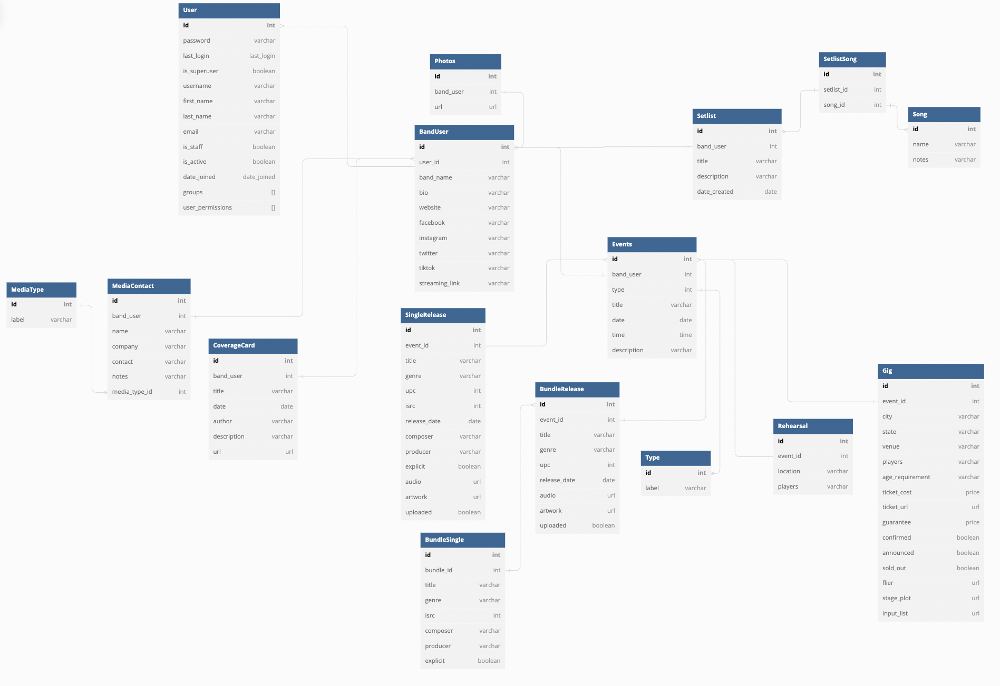

# Welcome to Bandplanner

> A tool that helps independent musicians stay organized, focused and inspired  
01:43 ━━━━●───── 03:50  
⇆ㅤ ㅤ◁ㅤ ❚❚ ㅤ▷ ㅤㅤ↻ 
ᴠᴏʟᴜᴍᴇ : ▮▮▮▮▮▮▮▮▮▮  

### Application Overview

Working as an independent musician can be very challenging, especially when you’re trying to focus on what, in theory, should matter the most - the music. Musicians or bands that function without a record label, manager, booking agent, and publicist often struggle to carry the weight of all of these responsibilities. My application, Bandplanner, aims to ease the burden of organizing and balancing these tasks so that musicians can spend more time focusing on their passion for music rather than getting hung up on the mundane aspects of the music business. 

## Features

Features include:
* Users can add, edit and delete different types of events to a React Full Calendar Library
* Users can create setlists and add, edit, delete, and rearrange songs with a drap and drop feature
* Users can search for live music events by artist name, location, and venue name via an external API
* Users can upload photos to their user profile with a Cloudinary widget

## ERD

<!--
 ##Video Walkthrough

## Public Link

 Use the provided login credentials *OR* Create your own user profile -->

## Author

Created by Jordan Victoria 

 
